# *Auto Mobile Insurance Analysis Using R-Programming Language*

***👩‍💻  Still under proccess...***

## *Author*

- [@Omar Soub](https://github.com/omars1234)


## *Overview*

*On this Project ,we will use R-Programming Language in order to conduct inferential analysis to analyse the data as much as we can to help decision making*


* *To access the project online on Rpubs Web ,Click on the below link*

  [*AutoMobilePricesAnalysis-http://rpubs.com/omars/1207895*](http://rpubs.com/omars/1208635)  
  
  

 ------------------------------------------------------------------

  

------------------------------------------------------------------ 

  


## *Table of Contents*

*  *Installation*  
*  *Data*  
*  *Usage*  
*  *Project Structure*  
*  *Results*  


## *Installation*  
*To run this project, you need to have R installed on your machine. Additionally, install the required libraries by running the following commands:*

```bash
library(tidyverse)
library(skimr)
library(dplyr)
library(gridExtra)
library(patchwork)
library(effectsize)
library(coin)
library(rstatix)
library(car)
library(dunn.test)
library(nortest)
library(ggstatsplot)
library(FSA)
library(ggplot2)
library(FactoMineR)
library(psych)
```

## *Data*  
*The dataset used for this project contains AutoMobile Insurance data. It includes the following columns:*


*veh_value : The AutoMobile sum insured*

*exposure : earned exposures*

*clm : claims Incurrence  0:No ,1:yes*

*numclaims : number of claims frequency*

*claimcst0 :  Incurred claims cost*

*veh_body : BUS,SEDAN,COUPE,HBACK...etc.*

*veh_age : 1,2,3,4*

*gender : F : Female , M : male*

*area : A,B,C,D,E,F*

*agecat : 1,2,3,4,5,6*


You can download the dataset from here.


## *Usage*

*Clone the repository:*


```bash
https://github.com/omars1234/R-Programming_AutoMobileInusranceAnalysis.git
```

## *Project Structure*


```bash
customer-segmentation/
├── Data/
│   └── data_car.csv
├── src/
│   ├── AutoInsurance_R.Rmd
│   |
│   |── visualization
│  
├── README.md
```

* *data/: Contains the dataset.*

* *src/: Contains R scripts for data preprocessing,*

* *clustering, and visualization.*

* *output/: Contains the results of the analysis.*

* *README.md: Project documentation.*


## *Results*

### *Explonatory Analysis :*


*Out of 67856 risk , we have 4624 with positive claims claims*

*Gender*
* *female had more claim percentage than males*

* *after applying pearson chisq test we found there is no significant difference between genders in respect of claims*


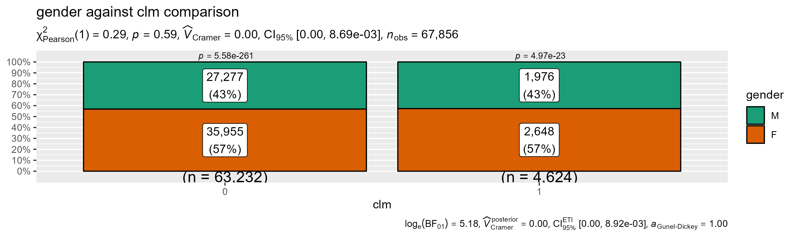

* *Gender claims probabilities*

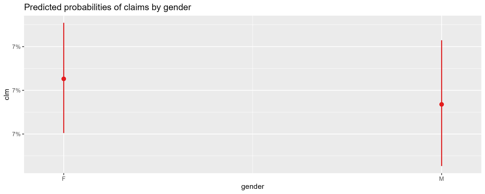


* *The probability of females having claims is little higher than the probability of males with .0686 females and 0.0675 for males*


----------------------------------------

*area*
* *area A has the highest number of claims with '31%'  percentage* 

* *area F has the lowest number  of claims with '6.1%' percentage*

* *after applying pearson chisq test we found there is significant difference between areas in respect of claims*


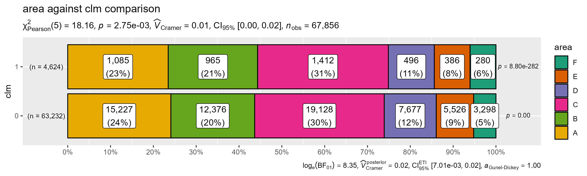


* *area claims probabilities*

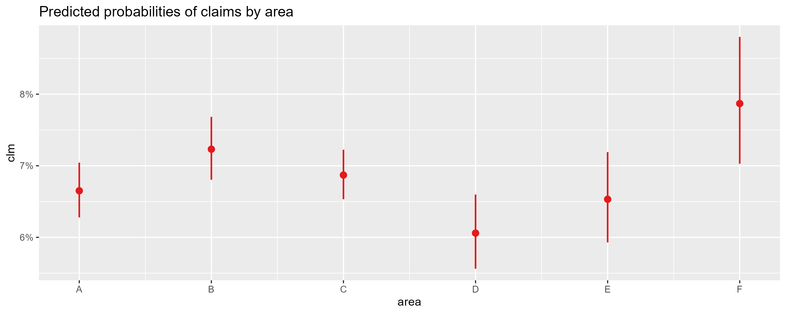

* *We can see that area== F has the highest probability of claimed with 0.0783%  and area== D has the lowest probability with 0.0607%*

----------------------------------------

*Age Category*  

* *Age Category 2 and 4 have  the highest number of claims with '24%' percentage for each -'noting that both categories has the highest count of total agecat observations'-*  

 * *Age Category 6  has the lowest number  of claims with '7.9%' percentage*    

 * *after applying pearson chisq test we found there is significant difference between Age Categories in respect of claims*

 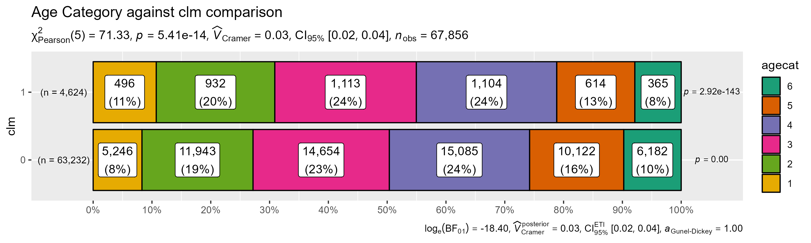

 * *Age_Category claims probabilities*

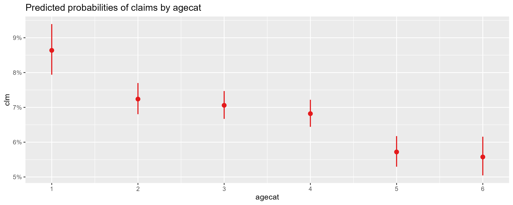

* *We can see that agecat== 1 has the highest probability of claimed with 0.0864%  and agecat== 6 has the lowest probability with 0.0558%*


----------------------------------------

*Vehicle Age*
* *Vehicle Age 3 has highest number of claims with '29%' percentage-'noting that it has the highest count of total Vehicle Age categories observations'-*  

* *Vehicle Age 1 has the lowest number  of claims with '18%' percentage*   

* *after applying pearson chisq test we found there is significant difference between Vehicle Ages in respect of claims*

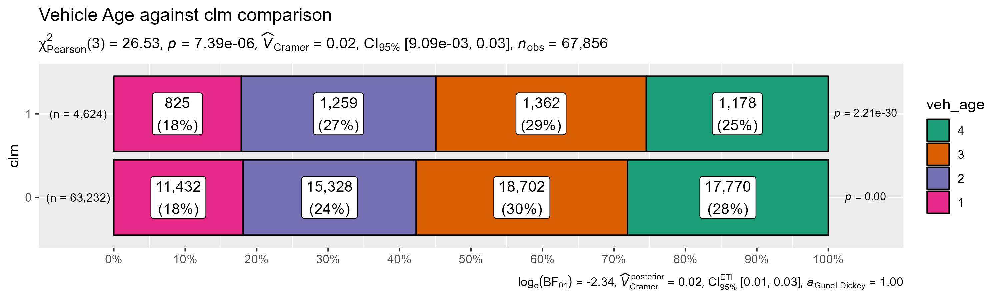


 * *Vehicle Age claims probabilities*

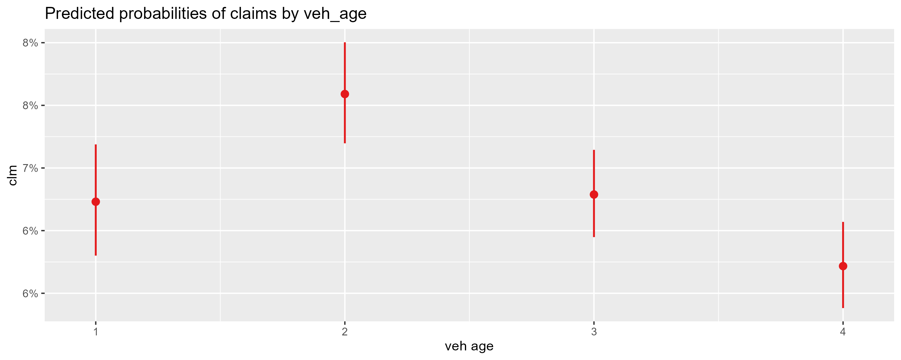

* *We can see that veh_age== 2 has the highest probability of claimed with 0.0759%  and veh_age== 4 has the lowest probability with 0.0622%*


----------------------------------------

*veh_body*

* *Sedan veh_body  has highest number of claims with '32%' percentage-'noting that it has the highest count of total veh_body observations'-* 

* *convt and RDSTR veh_body has the lowest number  of claims with less than '0.1%' percentage*

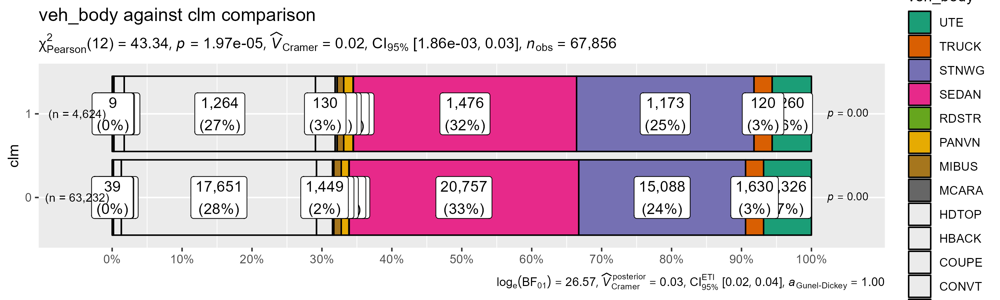

 * *veh_body claims probabilities*

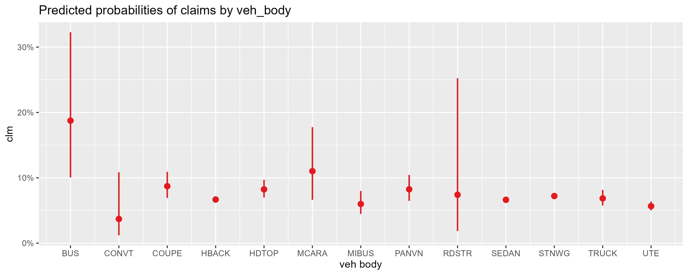

* *Sedan veh_body  has highest number of claims with '32%' percentage-'noting that it has the highest count of total veh_body observations'-* 

* *convt and RDSTR veh_body has the lowest number  of claims with less than '0.1%' percentage*


----------------------------------------

### *Inferential Analysis :*

* *The Anderson-Darling normality test (p-value < 0.05) indicates non-normal distribution*


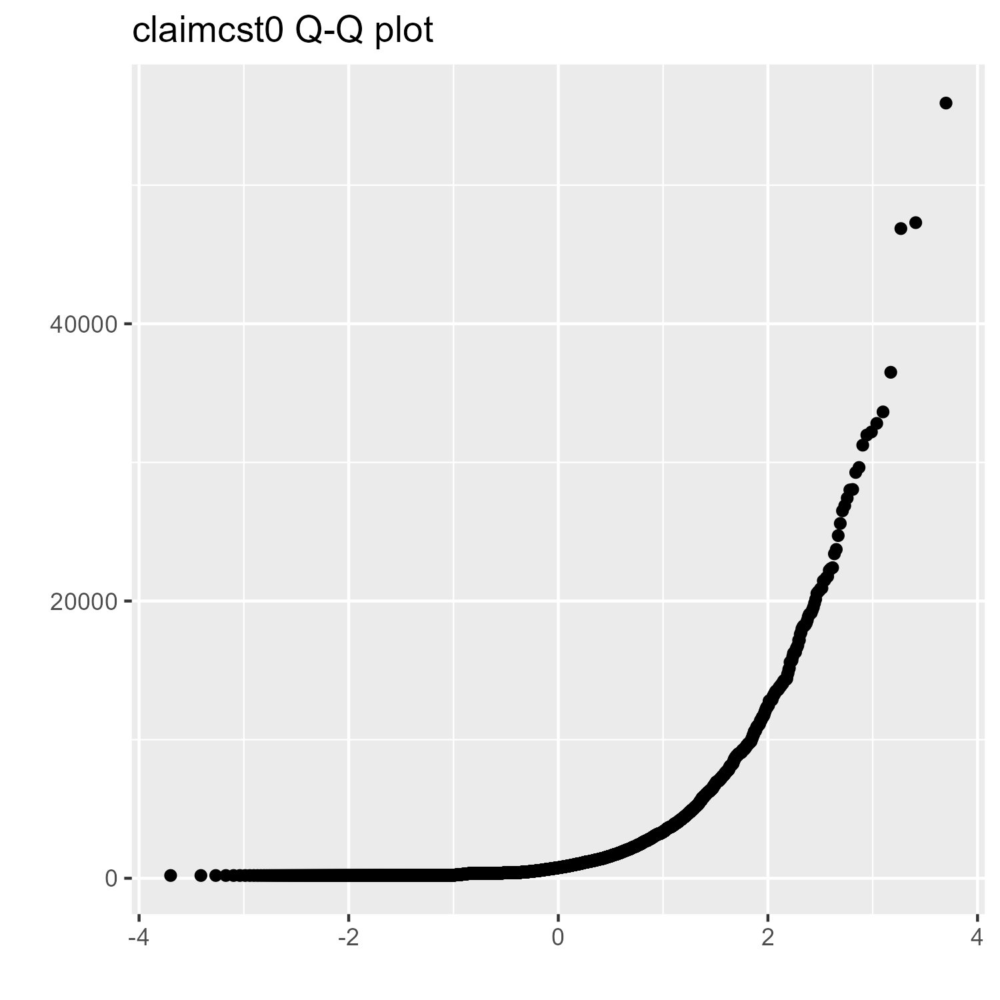


* *==> Given these results, We will be using non-parametric statistical tests*

*A.1 Mann-Whitney U Test on claimcst0 against gender :*

* *statistically there is significant difference in the data distribution between genders*

* *The wilcox_effsize test showed that the effect size= .0315 and the indicating small effect size*

* *leveneTest indicates that the variances are significantly different across the groups*

* *Post-hoc Power Analysis : The power of the test is 0.3277674,This means there is a 32.77% chance of detecting a true effect*

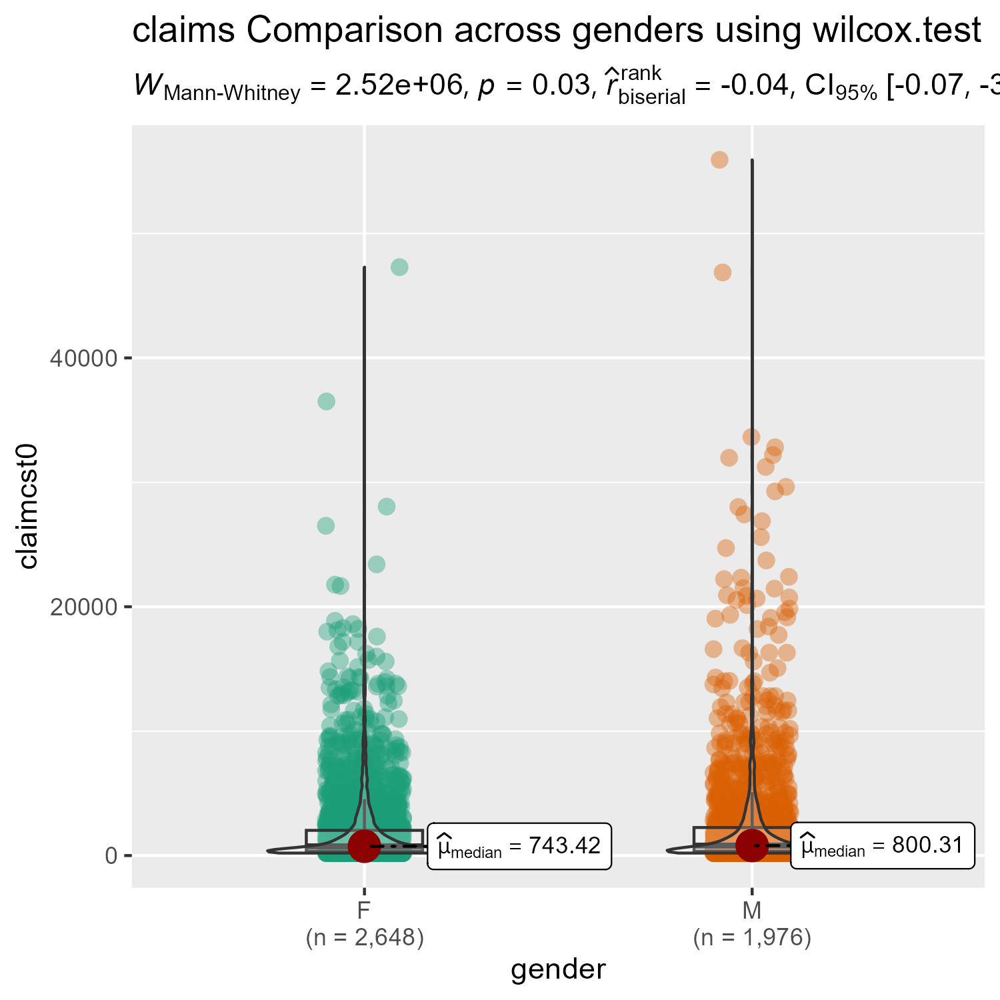

----------------------------------------

*B.1 kruskal.test on claims against area :*

* *statistically there is significant difference in the data distribution between areas*

* *he kruskal_effsize test showed that the effect size (epsilon_squared)= 0.004680724 and the indicating small effect size*

* *leveneTest indicates that the variances are significantly different across the groups*

* *Post-hoc Power Analysis : The power of the test is 0.966717,This means there is a 96% chance of detecting a true effect*

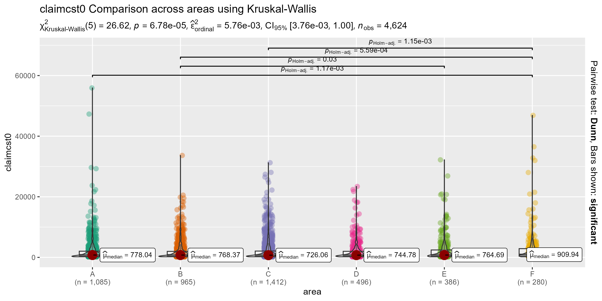

----------------------------------------

*B.2 kruskal.test on claims against veh_body*

* *statistically there is no significant difference in the data distribution between veh_body*

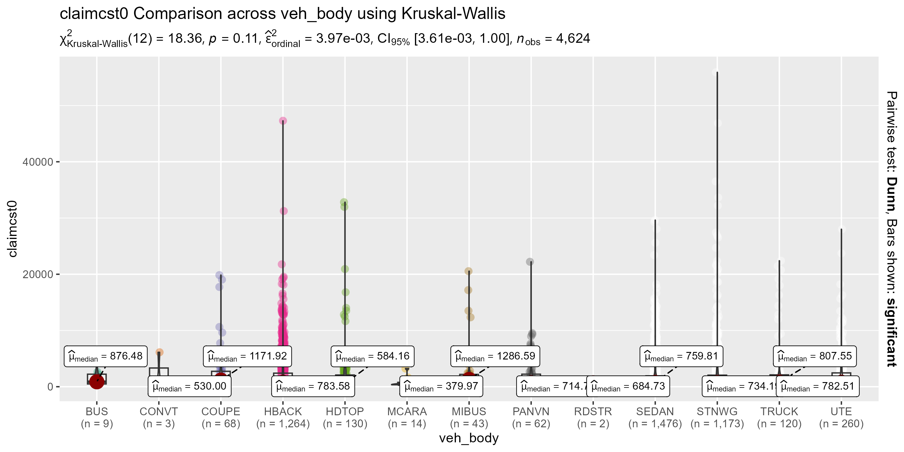

----------------------------------------

*B.3 kruskal.test on claims against age category*

* *statistically there is significant difference in the data distribution between agecat*

* *The kruskal_effsize test showed that the effect size (epsilon_squared)= 0.001320641 and the indicating small effect size*

* *leveneTest indicates that the variances are significantly different across the groups*

* *Post-hoc Power Analysis : The power of the test is 0.4397375,This means there is a 43.9% chance of detecting a true effect*


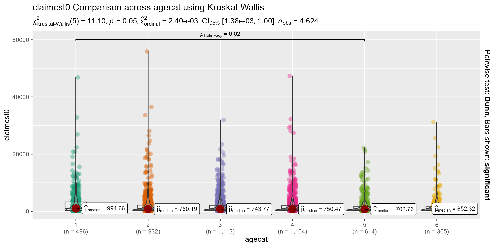


----------------------------------------

*B.4 kruskal.test on claims against number of claims*

* *statistically there is significant difference in the data distribution between numclaims*

* *The kruskal_effsize test showed that the effect size (epsilon_squared)= 0.0337713 and the indicating small effect size*

* *leveneTest indicates that the variances are not significantly different across the groups*

* *Post-hoc Power Analysis : The power of the test is 1,This means there is a 100% chance of detecting a true effect.*

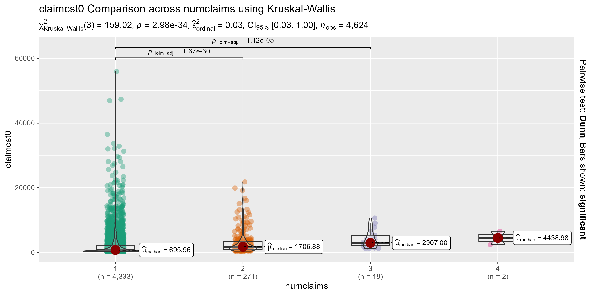

----------------------------------------

*B.5 kruskal.test on claims against veh_age*

* *statistically there is significant difference in the data distribution between veh_age*

* *he kruskal_effsize test showed that the effect size (epsilon_squared)= 0.003391443 and the indicating small effect size*

* *leveneTest indicates that the variances are not significantly different across the groups*

* *Post-hoc Power Analysis : The power of the test is 0.92,This means there is a 92% chance of detecting a true effect*

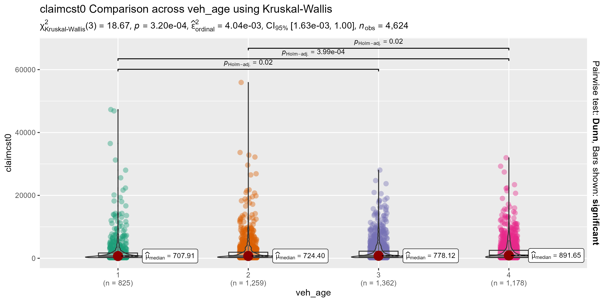

----------------------------------------


### *Insurance risk measurements by factors:*

*Gender*

| gender       |claimcst0 |numclaims|exposure|frequency|average_severity|risk_premium|
| -------------| -------- | --------|--------|---------|----------------|------------|
|  F           |	4908749 |	2832|	17954.60|	0.1577311	|1733.315|	273.3978|
|  M           |	4405855 |2105	|13846.21|	0.1520271|	2093.043|	318.1993|

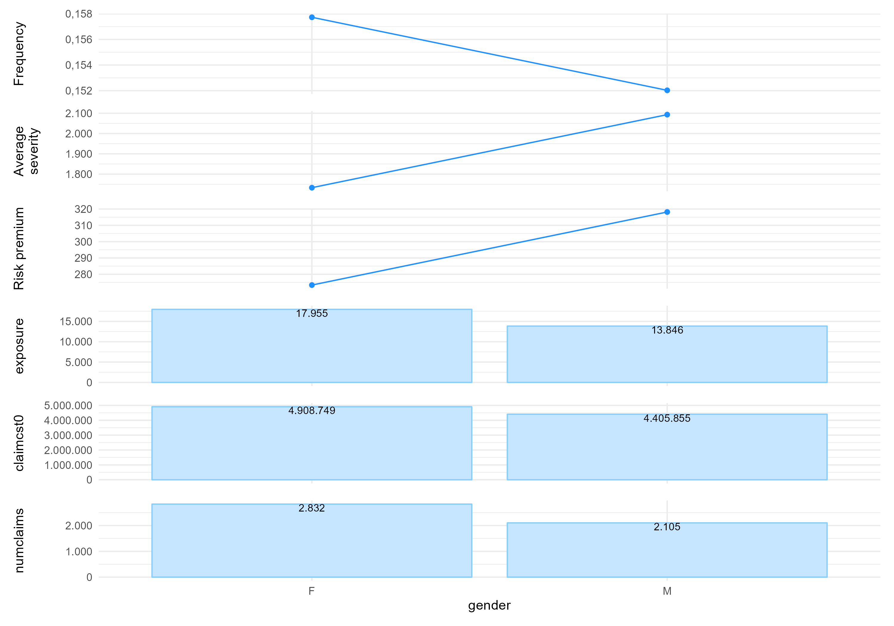

----------------------------------------

*veh_age*

| veh_age       |claimcst0 |numclaims|exposure|frequency|average_severity|risk_premium|
| -------------| -------- | --------|--------|---------|----------------|------------|
|3|	2718237|	1446|	9542.111|	0.1515388|	1879.832|	284.8675|
|2|	2486217	|1354|	7923.677|	0.1708803|	1836.202|	313.7706|
|4|	2554895	|1261|	8996.079|	0.1401722|	2026.087|	284.0010|
|1|	1555255	|876|	5338.951|	0.1640772|	1775.405|	291.3034|


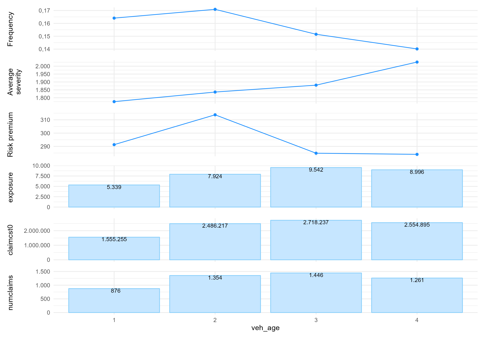


----------------------------------------

*veh_body factor*

| veh_body       |claimcst0 |numclaims|exposure|frequency|average_severity|risk_premium|
| -------------| -------- | --------|--------|---------|----------------|------------|
|HBACK|	2589136.192|	1330|	8810.31348|	0.1509594|	1946.7189|	293.8756|
|UTE|	597208.965|	276|	2105.73032|	0.1310709|	2163.8006|	283.6113|
|STNWG|	2363091.211|	1248|	7638.39014|	0.1633852|	1893.5026|	309.3703|
|HDTOP|	294811.869|	136|	783.29911|	0.1736246|	2167.7343|	376.3720|
|PANVN|	133113.412|	68|	409.16085|	0.1661938|	1957.5502|	325.3327|
|SEDAN|	2681622.477|	1598|	10444.59959|	0.1529977|	1678.1117|	256.7473|
|TRUCK|	319496.849|	130|	843.96441|	0.1540349|	2457.6681|	378.5667|
|COUPE|	187723.251|	75|	319.12663|	0.2350164|	2502.9767|	588.2406|
|MIBUS|	116104.880|	45|	316.84052|	0.1420273|	2580.1084|	366.4458|
|MCARA|	10673.950|	15|	59.27995|	0.2530367|	711.5967|	180.0601|
|BUS	|13363.120|	10|	25.84805|	0.3868764|	1336.3120|	516.9876|
|CONVT|	6888.810|	3|	32.59685|	0.0920334|	2296.2700|	211.3336|
|RDSTR|	1369.458|	3|	11.66872|	0.2570976|	456.4861|	117.3615|


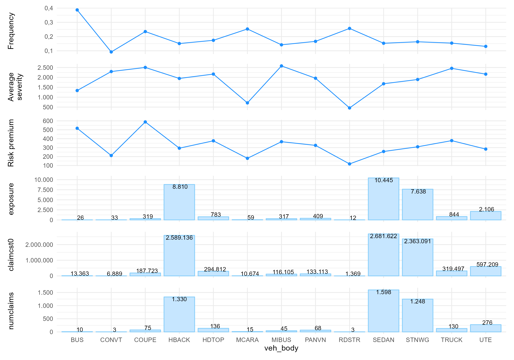


----------------------------------------

*area*

| area       |claimcst0 |numclaims|exposure|frequency|average_severity|risk_premium|
| -------------| -------- | --------|--------|---------|----------------|------------|
|C	|2865707.2	|1493	|9578.494	|0.1558700	|1919.429	|299.1814|
|A	|2071765.6	|1181	|7597.101	|0.1554540	|1754.247	|272.7048|
|E|	868822.9	|413	|2771.866	|0.1489971	|2103.687	|313.4434|
|D|	911058.2	|524	|3819.518	|0.1371901	|1738.661	|238.5270|
|B|	1795295.2	|1021	|6297.848	|0.1621189	|1758.369	|285.0649|
|F|	801955.4	|305	|1735.992	|0.1756921	|2629.362	|461.9581|

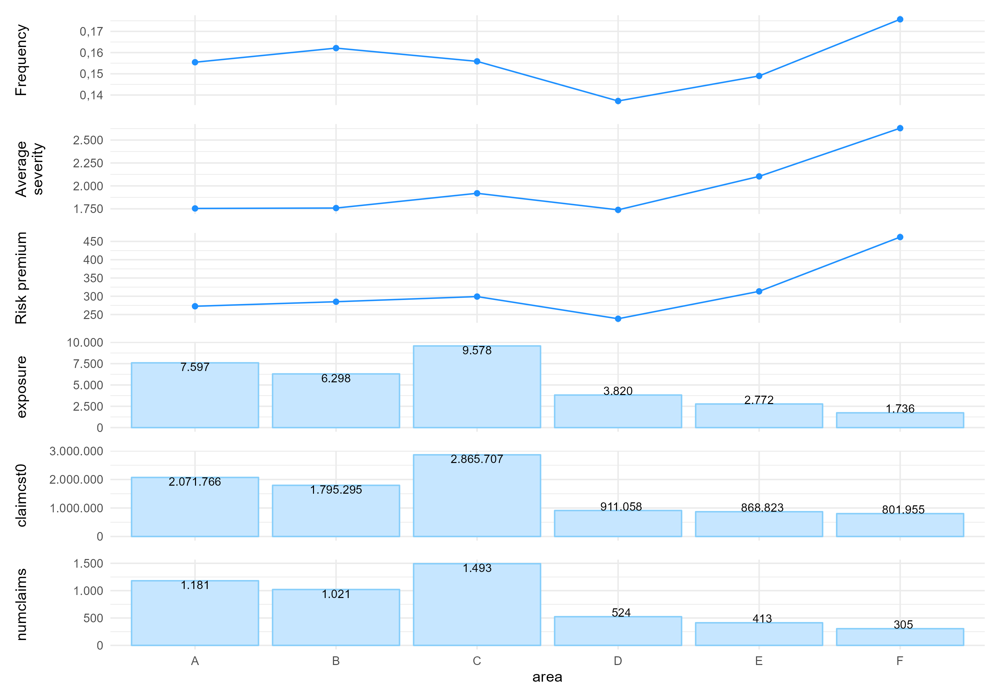

----------------------------------------

*age category factor*

| age category       |claimcst0 |numclaims|exposure|frequency|average_severity|risk_premium|
| -------------| -------- | --------|--------|---------|----------------|------------|
|2	|1984840.8	|1000	|5891.871	|0.1697254	|1984.841	|336.8778
|4	|2145303.0	|1185	|7616.542	|0.1555824	|1810.382	|281.6636|
|6	|683568.5	|390	|3099.666	|0.1258200	|1752.740	|220.5297|
|3	|2132107.1	|1189	|7409.457	|0.1604706	|1793.194	|287.7549|
|5	|1061412.2	|648	|5171.009	|0.1253140	|1637.982	|205.2621|
|1	|1307372.9	|525	|2612.274	|0.2009743	|2490.234	|500.4732|

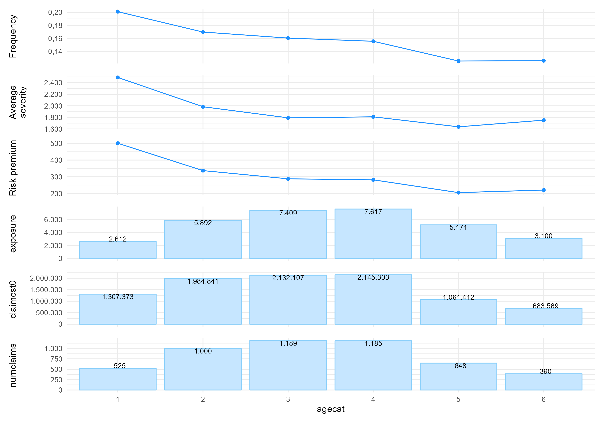

----------------------------------------


* *To access the project online on Rpubs Web ,Click on the below link or The below RPubs Logo*

  [*AutoMobilePricesAnalysis-http://rpubs.com/omars/1207895*](http://rpubs.com/omars/1208635) 

[](http://rpubs.com/omars/1208635)


***👩‍💻  Still under proccess...***


